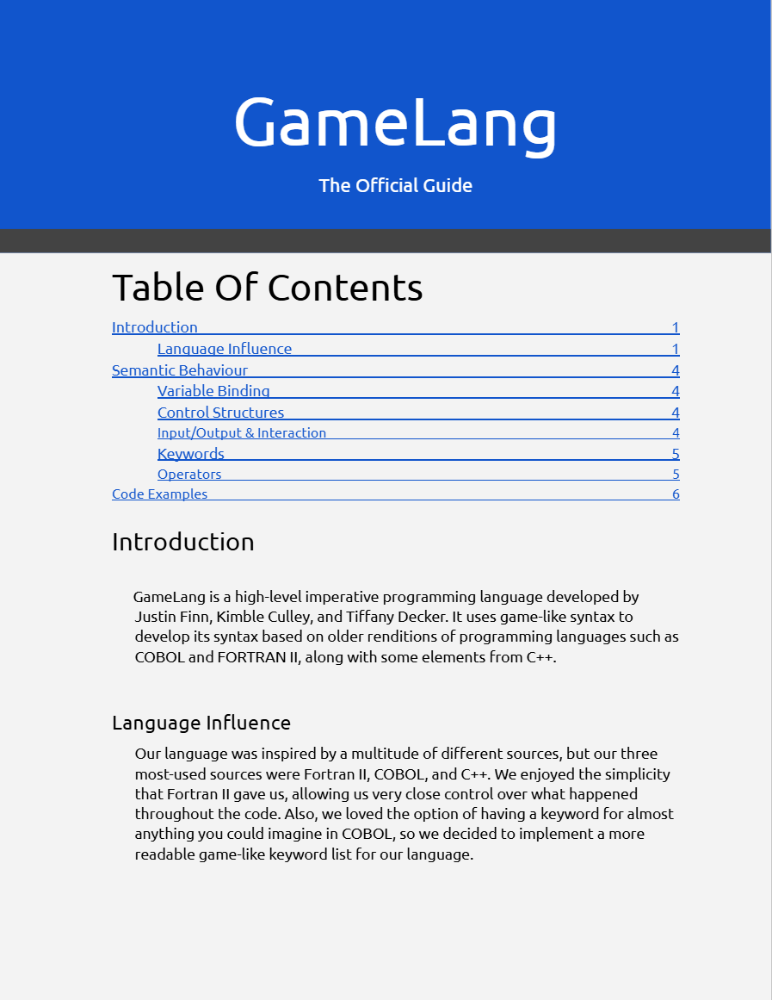

# Purpose

GameLang is a high-level imperative programming language developed by Justin Finn, Kimble Culley, and Tiffany Decker. It uses game-like syntax to develop its syntax based on older renditions of programming languages such as COBOL and FORTRAN II, along with some elements from C++. We took our love for games and developed a language with basic functionality. 

## Manual and Google Document

Link to the document here -> https://docs.google.com/document/d/1s8d7fqp6QnAy_vDaZrc39SZdUS8IP_KKnbYzo1lXtZ4/edit?usp=sharing
